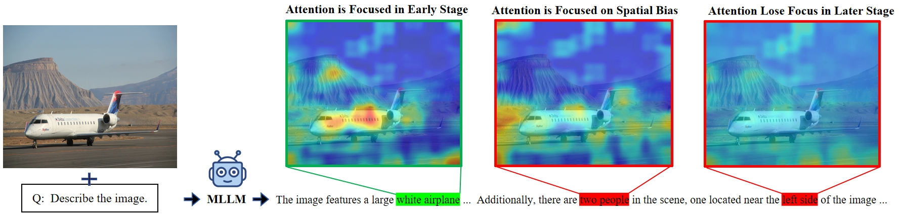
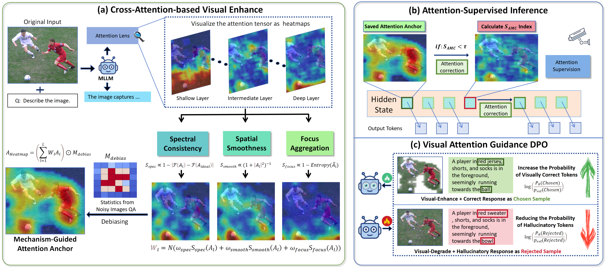
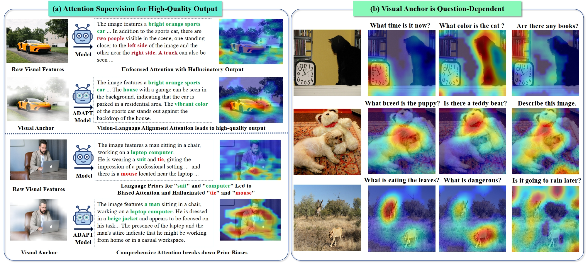

# ADAPT: Attention Dynamics Alignment with Preference Tuning for Faithful MLLMs

<div align="center">

**ECCV 2026**

</div>

Official implementation of the ECCV 2026 paper **"ADAPT: Attention Dynamics Alignment with Preference Tuning for Faithful MLLMs"** by Zhiyuan Yao, Zheren Fu, Zhixiao Zheng, Jiajun Li, Yi Tu, and Zhendong Mao.

---

## Motivation

Our investigation reveals that MLLM hallucination involves a predictable two-stage degradation of visual attention during generation:

1. **Strong Visual Anchoring Phase** — early tokens are firmly grounded in query-relevant visual evidence, with concentrated and adaptive cross-attention patterns.

2. **Prior-Dominated Generation Phase** — as output length increases, cross-attention progressively decays: it becomes unfocused (spread across many tokens), spatially biased (collapsed to irrelevant regions), and less responsive to newly generated text. The model increasingly relies on language priors, making hallucinations more probable in later tokens.



This degradation manifests in three measurable signals:
- Cross-attention drifts away from text-relevant regions and becomes spatially unfocused or biased.
- Cross-attention becomes increasingly rigid, with a decreasing change rate in response to new tokens.
- The overall attention mass on visual tokens drops across layers as decoding proceeds.

Together, these signals form a reliable precursor of hallucination—and a direct target for intervention.

## ADAPT Framework

ADAPT addresses hallucination at three synergistic stages:

### 1. Cross-Attention Visual Anchor

We extract cross-attention from the first $K$ early decoding tokens (the reliable Visually Grounded Phase) and refine them into a stable visual anchor. Each layer's attention map is scored with three complementary criteria:
- **Spectral Consistency** — penalizes high-frequency noise via FFT energy ratio.
- **Spatial Smoothness** — favors contiguous object regions over fragmented activations.
- **Adaptive Focus** — matches the attention concentration to the query-dependent target entropy.

The layer-wise scores are projected to fusion weights via a learned linear combination and Softmax, producing a weighted multi-layer attention map. We then apply spatial bias correction using a debiasing mask estimated from noise-image runs, which suppresses attention-sink tokens that attract spurious focus regardless of image content. The resulting anchor is query-aware, layer-selective, and corrected for positional bias.

### 2. Attention-Supervised Inference (ASI)

During autoregressive decoding, we monitor cross-attention against the anchor using the **Anchor-Modulated Concentration (AMC)** index:

$$S_{\text{AMC}}(A_t \| A_{\text{anchor}}) = \frac{\sum_i a_{i,t}^2 \cdot w_i^{\text{anchor}}}{(\sum_i a_{i,t})^2}$$

AMC jointly penalizes unfocused attention (via $a_i^2$) and spatial bias (via down-weighting regions with near-zero anchor weights). When $S_{\text{AMC}}$ falls below a threshold $\tau$, we apply sparse corrective steering:

$$\hat{a}_{i,t} = a_{i,t} + \alpha \cdot \log(w_i^{\text{anchor}} + \epsilon)$$

This injects an anchor-derived log-prior that softly re-steers attention toward visually grounded regions without imposing a hard constraint. In practice, intervention is sparse—activating primarily in the Prior-Dominated Phase where hallucinations are most likely.

### 3. Visual Attention Guidance DPO (VAG-DPO)

We strengthen the model's intrinsic preference for visually grounded responses through preference optimization. Unlike standard DPO that contrasts at the textual level, VAG-DPO contrasts under different visual evidence conditions:
- **Chosen** — factual response conditioned on an anchor-enhanced image that highlights query-relevant regions.
- **Rejected** — hallucinatory response paired with a noise-injected image, creating a "blind" condition.

By explicitly decoupling visual grounding from linguistic priors, VAG-DPO penalizes high-confidence hallucinations and encourages generation probabilities to remain contingent on valid visual support.



## Main Results

ADAPT achieves state-of-the-art performance across multiple hallucination benchmarks, reducing hallucination rates by **40–60%** across mainstream backbones (LLaVA-v1.5-7B/13B, Qwen2.5-VL-3B/7B).

| Benchmark | Baseline (7B) | ADAPT (7B) | Reduction |
|-----------|:------------:|:---------:|:---------:|
| AMBER Chair | 7.8 | **3.8** | 51% |
| AMBER Hal | 36.4 | **15.2** | 58% |
| AMBER Cog | 4.2 | **1.2** | 71% |
| POPE Adv. Precision | 76.1 | **91.9** | +15.8 pts |

A lightweight training-free variant (**ADAPT-TF**) already surpasses most prior methods, while the full ADAPT achieves the best overall results. Despite the multi-stage design, ADAPT introduces only **1.42×** inference-time overhead—significantly more efficient than competing approaches (VCD: 2.03×, OPERA: 7.20×, GF-SCD: 3.96×).

## Repository Structure

```text
ADAPT/
├── adapt/
│   ├── config.py          # Configuration class and default hyperparameters
│   ├── hook_manager.py    # Lightweight PyTorch hook registration system
│   ├── hook_logger.py     # Cross-attention recording + modification (HHI & quality modes)
│   ├── scorer.py          # Multi-criteria attention quality scoring + layer fusion
│   ├── anchor.py          # Visual anchor construction, refinement, and visualization
│   ├── inference.py       # AMC scoring and attention steering operator
│   └── utils.py           # Image I/O and tensor conversion utilities
├── eval/
│   └── run_amber.py       # AMBER benchmark evaluation with ADAPT
├── examples/
│   └── demo.py            # Single image-question inference demo
├── image/                 # Paper figures
├── requirements.txt
├── setup.py
└── README.md
```

## Installation

```bash
git clone https://github.com/yao-ustc/ADAPT.git
cd ADAPT
pip install -e .
```

ADAPT requires a working LLaVA environment (model, tokenizer, image processor). The code has been tested with LLaVA-v1.5-7B/13B and Qwen2.5-VL-3B/7B.

## Quick Start

```python
from adapt import ADAPTConfig, hook_logger_multi
from adapt.anchor import compute_anchor, refine_cross_attention_anchor

# Load your LLaVA model
# model = ...

cfg = ADAPTConfig()

# Register ADAPT hooks on all cross-attention layers
hook_loggers = hook_logger_multi(
    model, model.device,
    layer_indices=list(range(32)),
    modify_attention=True,       # enable attention supervision
    mode="quality",              # 'hhi' or 'quality' redistribution
    initial_phase_calls=5,       # K: early tokens for anchor
    adaptive_k1=0.4,             # intervention strength
    cfg=cfg,
)

# Generate as usual — hooks apply supervision automatically
# output = model.generate(...)

# Extract the cross-attention visual anchor
layer_maps = {}
for layer_idx, logger in hook_loggers.items():
    anchor = logger.get_anchor_map(avg_tokens=5)
    if anchor is not None:
        layer_maps[layer_idx] = anchor

fused_anchor = compute_anchor(layer_maps, cfg=cfg)

# Visualize: overlay anchor on the input image
refine_cross_attention_anchor(
    layer_maps,
    image_path="input.jpg",
    output_path="anchor_heatmap.jpg",
)
```

## Demo

```bash
python examples/demo.py \
    --model-path liuhaotian/llava-v1.5-7b \
    --image path/to/image.jpg \
    --question "Describe this image in detail." \
    --mode quality \
    --save-anchor anchor_output.jpg
```

## AMBER Benchmark Evaluation

```bash
python -m eval.run_amber \
    --model-path liuhaotian/llava-v1.5-7b \
    --image-folder /path/to/AMBER/images \
    --question-file /path/to/AMBER/questions.json \
    --answers-file ./results/amber_results.jsonl \
    --use-adapt \
    --mode quality \
    --adaptive-k1 0.4
```



## Key Parameters

| Parameter                 | Default | Description                                                        |
| ------------------------- | ------: | ------------------------------------------------------------------ |
| `initial_phase_calls` (K) |     `5` | Number of early tokens used to construct the visual anchor         |
| `adaptive_k1`             |   `0.4` | Intervention strength for attention correction (HHI mode)          |
| `AMC_THRESHOLD_TAU`       |   `0.6` | AMC threshold for triggering attention steering                    |
| `STEERING_STRENGTH_ALPHA` |   `0.5` | Log-prior injection strength                                       |
| `WEIGHT_BOUNDARY_PENALTY`  |  `0.25` | Weight for boundary penalty in layer fusion                       |
| `WEIGHT_FREQUENCY_MATCH`  |  `0.30` | Weight for spectral consistency in layer fusion                   |
| `WEIGHT_SMOOTHNESS`       |  `0.15` | Weight for spatial smoothness in layer fusion                     |
| `WEIGHT_CONCENTRATION`    |  `0.20` | Weight for attention concentration in layer fusion                |
| `WEIGHT_LAYER_POSITION`   |  `0.10` | Weight for layer-depth prior in layer fusion                      |

## Citation

If you find ADAPT useful for your research, please cite:

```bibtex
@inproceedings{yao2026adapt,
  title     = {ADAPT: Attention Dynamics Alignment with Preference Tuning for Faithful MLLMs},
  author    = {Yao, Zhiyuan and Fu, Zheren and Zheng, Zhixiao and Li, Jiajun and Tu, Yi and Mao, Zhendong},
  booktitle = {European Conference on Computer Vision (ECCV)},
  year      = {2026}
}
```

## License

This project is released under the MIT License.
